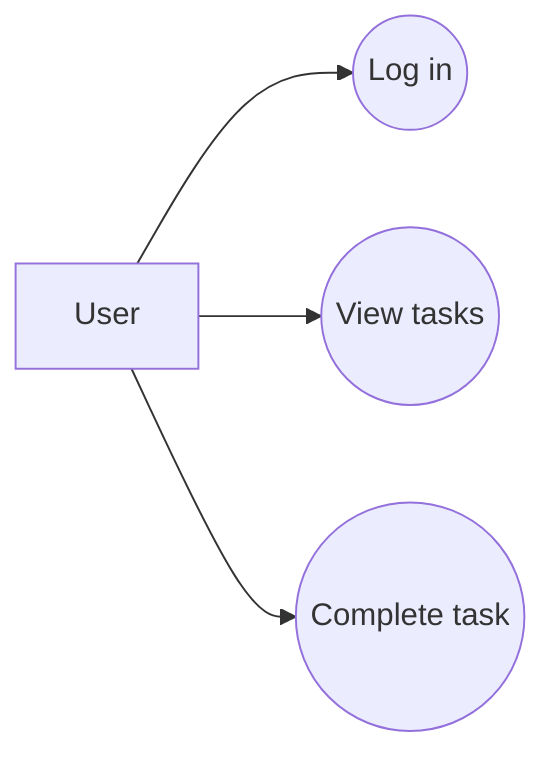
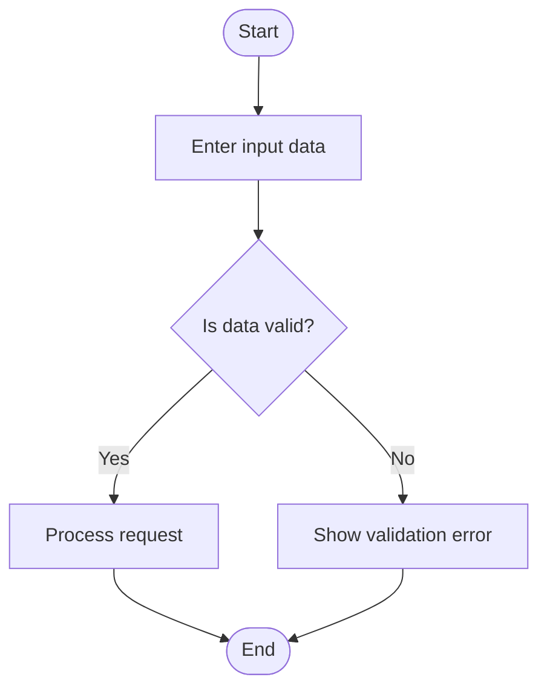
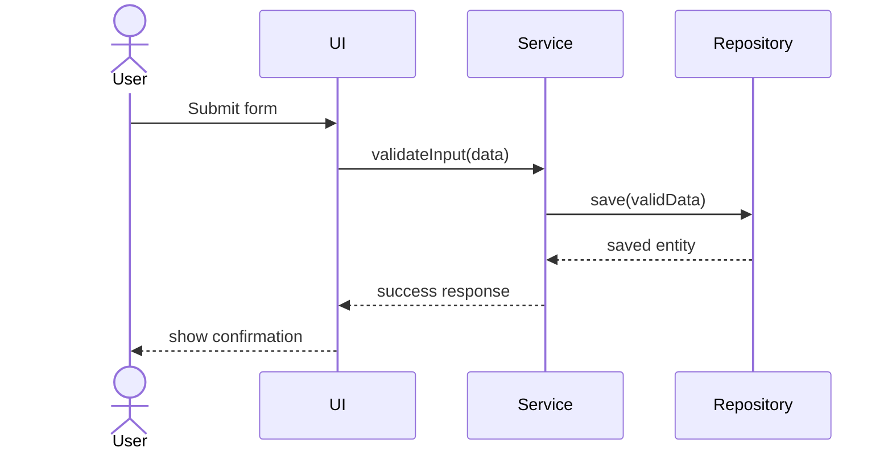

# UML-as-Code and Mermaid.js

## Summary

UML is a modeling language used to specify, visualize, construct, and document software systems. Mermaid.js allows diagrams to be written as text and stored directly in Markdown files.

This makes diagrams version-controlled, reviewable in Pull Requests, and useful as AI context.

## Why UML Matters

UML helps communicate software structure and behavior through diagrams.

Useful UML ideas for the course project include:

- use case diagrams for external behavior,
- class diagrams for static structure,
- sequence diagrams for object interaction,
- activity diagrams for workflows,
- state diagrams for state transitions.

## UML as Views

A UML diagram is not the whole system. It is a selected view of the system.

Different diagrams answer different questions:

| Diagram | Main Question |
|---|---|
| Use Case Diagram | What can users do with the system? |
| Class Diagram | What concepts and relationships exist? |
| Sequence Diagram | How do objects/components communicate over time? |
| Activity Diagram | What is the workflow? |
| State Diagram | How does an object move between states? |

## Mermaid.js Benefits

Mermaid diagrams are useful because they are:

- text-based,
- easy to store in Git,
- readable in Markdown,
- reviewable in Pull Requests,
- useful as context for AI agents.

## Example: Use Case Diagram

## Example: Activity Diagram

## Example: Sequence Diagram

## Course Relevance

UML-as-code supports AI-native development because it gives AI agents structured visual logic without relying on vague natural language alone.
