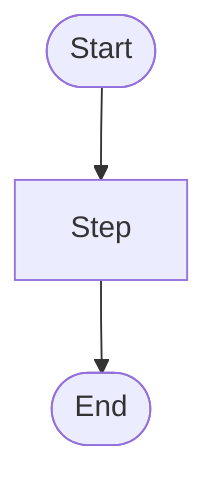

# AI-Native User Story Template

## Story ID

STORY-XXX

## Title

Short title of the atomic story.

## User Story

```text
As a [role],
I want to [action],
so that [value].
```

## Context

Relevant project context:

- Related epic:
- Related files:
- Related documentation:
- Existing pattern to follow:

## Constraints

- Do:
- Do not:
- Technology constraints:
- Security constraints:
- UI constraints:
- Data constraints:

## Acceptance Criteria

```gherkin
Scenario: [Scenario name]
  Given [initial context]
  When [specific action]
  Then [expected result]
```

## Edge Cases

- 
- 
- 

## Pure Function Contract

Function name:

Input:

Output:

Rules:

Side effects allowed: No

## Mermaid Diagram



## Testing Notes

- Unit tests:
- Integration tests:
- Manual checks:
