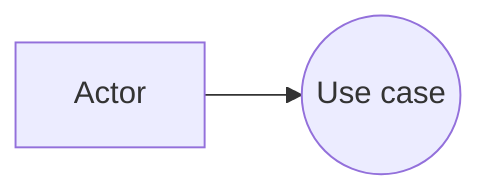
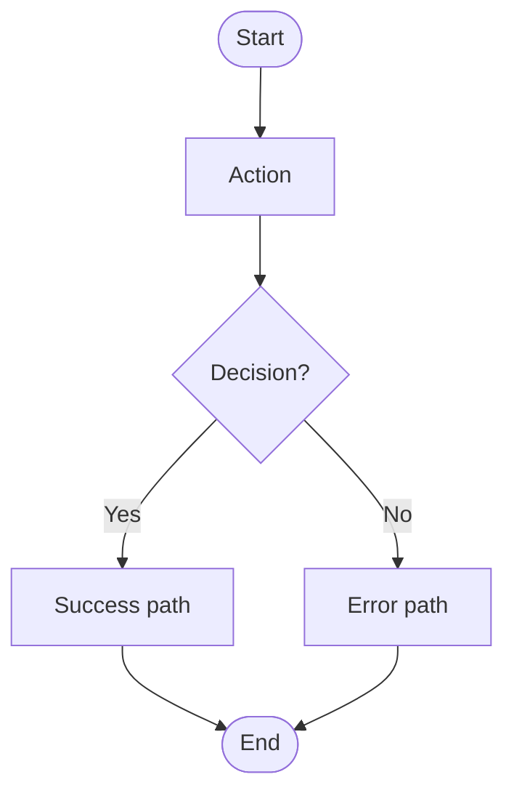
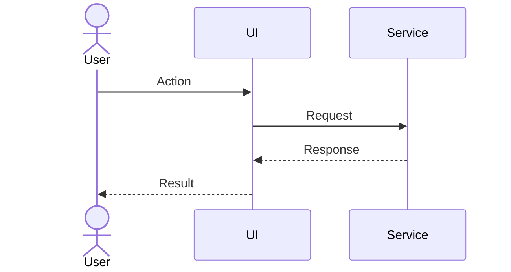
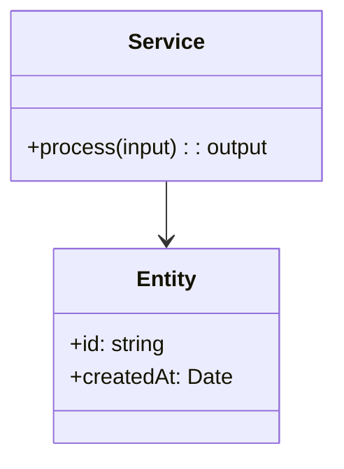

# Mermaid UML Template

## Use Case Diagram

```mermaid
flowchart LR
    Actor[Actor] --> UseCase((Use case))
```

## Activity Diagram

```mermaid
flowchart TD
    Start([Start]) --> Action[Action]
    Action --> Decision{Decision?}
    Decision -- Yes --> Success[Success path]
    Decision -- No --> Error[Error path]
    Success --> End([End])
    Error --> End
```

## Sequence Diagram

```mermaid
sequenceDiagram
    actor User
    participant UI
    participant Service

    User->>UI: Action
    UI->>Service: Request
    Service-->>UI: Response
    UI-->>User: Result
```

## Class Diagram

```mermaid
classDiagram
    class Entity {
      +id: string
      +createdAt: Date
    }

    class Service {
      +process(input): output
    }

    Service --> Entity
```
