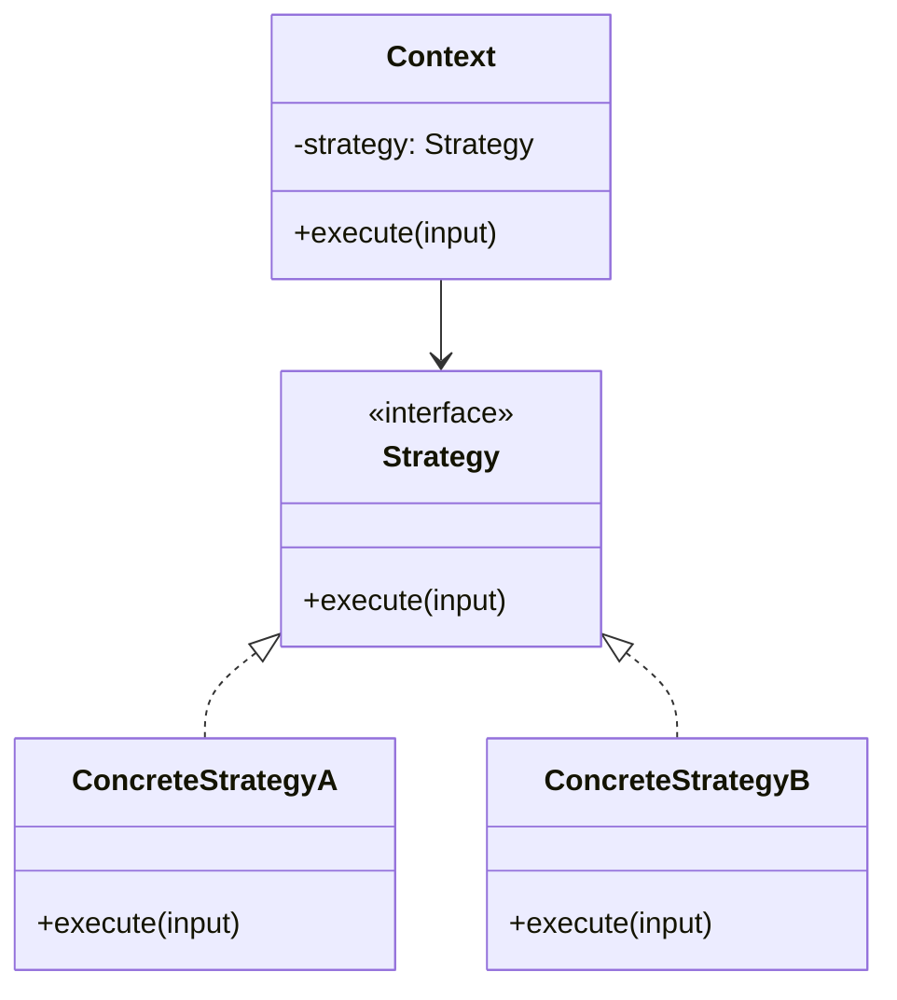

# Pattern Implementation Report

## Feature

Name of the selected feature from Assignment 3.

## User Story

```text
As a [role],
I want to [action],
so that [value].
```

## Chosen Pattern

Pattern name:

Pattern type: Creational / Structural / Behavioral

## Why This Pattern Fits

Explain why this feature needs this pattern.

## Mermaid Class Diagram



## Participants

| Participant | Responsibility |
|---|---|
| Context |  |
| Strategy Interface |  |
| Concrete Strategy A |  |
| Concrete Strategy B |  |

## Implementation Notes

- 
- 
- 

## Tests

- [ ] Happy path.
- [ ] Alternative strategy / behavior.
- [ ] Invalid input.
- [ ] Edge case.
- [ ] Pattern extension test.

## Consequences

### Benefits

- 
- 

### Trade-offs

- 
- 
