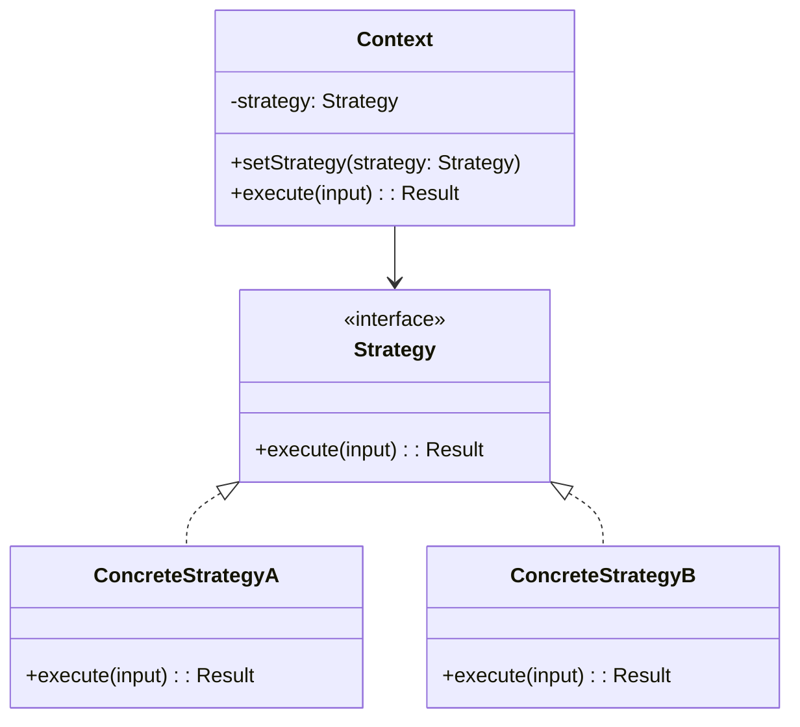

# Strategy Pattern Mermaid Template

```mermaid
classDiagram
    class Context {
      -strategy: Strategy
      +setStrategy(strategy: Strategy)
      +execute(input): Result
    }

    class Strategy {
      <<interface>>
      +execute(input): Result
    }

    class ConcreteStrategyA {
      +execute(input): Result
    }

    class ConcreteStrategyB {
      +execute(input): Result
    }

    Context --> Strategy
    Strategy <|.. ConcreteStrategyA
    Strategy <|.. ConcreteStrategyB
```
